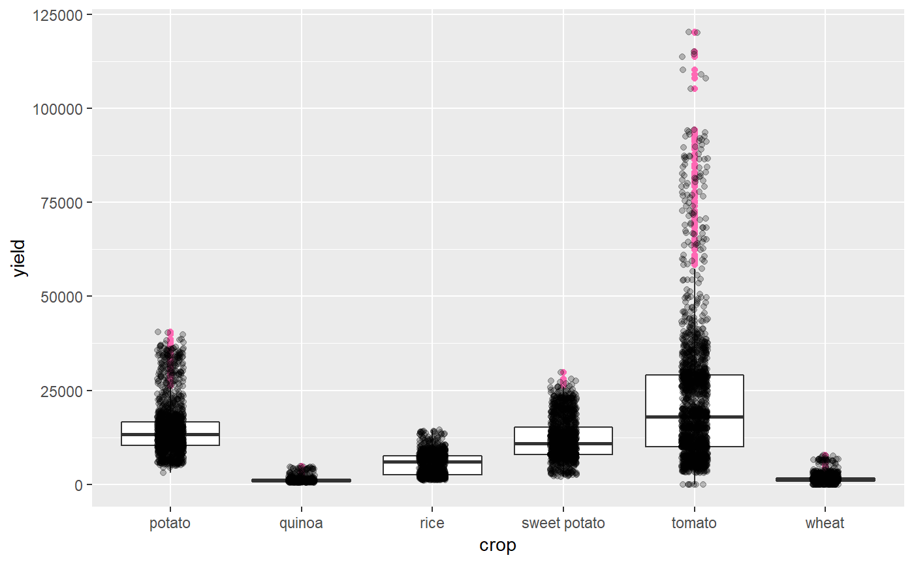
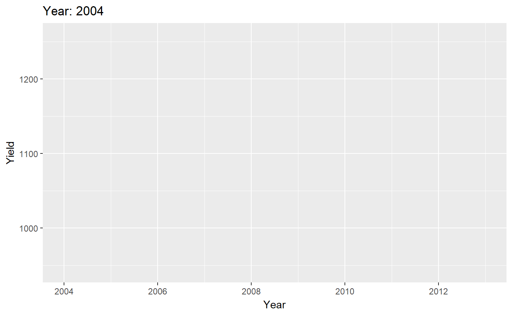

<!-- README.md is generated from README.Rmd. Please edit that file -->
cropdatape
==========

`cropdatape` provides peruvian agricultural production data from the Agriculture Minestry of Peru (MINAGRI). The first version includes 6 crops: rice, quinoa, potato, sweet potato, tomato and wheat; all of them across 24 departments. Initially, in excel files which has been transformed and assembled using tidy data principles, i.e. each variable is in a column, each observation is a row and each value is in a cell. The variables variables are sowing and harvest area per crop, yield, production and price per plot, every one year, from 2004 to 2014.

Installation
------------

You can install `cropdatape` directly from `CRAN`:

``` r
install.packages("cropdatape")
```

Or, you can install from `GitHub`:

``` r
# install.packages("devtools")
devtools::install_github("omarbenites/cropdatape")
```

The `cropdatape` data frame include 9 variables,

| variable   | meaning             | units |
|:-----------|:--------------------|-------|
| crop       | crop                | -     |
| department | deparment or region | -     |
| year       | year                | -     |
| month      | month               | -     |
| sowa       | sowing area         | ha    |
| harva      | harvested area      | ha    |
| production | production          | t     |
| yield      | yield               | kg/ha |
| pricePlot  | price per plot      | s/kg  |

### Usage

### Example 1: Filter, grouped and summarize cropdatape data

In this example, we will explore the cropdatape dataset, using three (dplyr) functionlities: `filter`, `group` and `summarize`.

1.  `filter` crop by `sweet potato`.
2.  `group_by` department column.
3.  `summarise` by mean of the sweetpotato yield.

`cropdatape` package:

``` r
#Load cropdatape package
library(cropdatape)
#Load dplyr package to filter and select information
library(dplyr)
cropdatape %>% 
      filter(crop == "sweet potato") %>% 
      group_by(department, year) %>% 
      summarise(yieldMean = mean(yield, na.rm = TRUE))
#> # A tibble: 235 x 3
#> # Groups:   department [?]
#>    department  year yieldMean
#>    <fct>      <dbl>     <dbl>
#>  1 Amazonas    2004      NaN 
#>  2 Amazonas    2005     7100.
#>  3 Amazonas    2006     6754.
#>  4 Amazonas    2007     9254.
#>  5 Amazonas    2008    10185.
#>  6 Amazonas    2009     8009.
#>  7 Amazonas    2010     7817.
#>  8 Amazonas    2011     7769.
#>  9 Amazonas    2012     8017.
#> 10 Amazonas    2013     7150.
#> # ... with 225 more rows
```

### Example 2: Plot graphics with ggplot using cropdatape data

This second example we will explore the behaviour of the `yield` varible grouped by `crop`, from 2004 till 2014. The `crop` variable involves 6 crops: potato, quinoa, rice, sweet potato and wheat.

``` r
library(cropdatape)
library(ggplot2)
ggplot(cropdatape, aes(x = crop, y = yield)) +
  geom_boxplot(outlier.colour = "hotpink") +
  geom_jitter(position = position_jitter(width = 0.1, height = 0), alpha = 1/4)
```



Example 3: Animations with gganimate
------------------------------------

To begin with, install the following packages from Github:

``` r
#Install first devtools package
#install.packages("devtools")
library(devtools)
install_github("thomasp85/gganimate")
install_github("thomasp85/transformr")
install_github("thomasp85/tweenr")
```

Then, we will filter all the information related to sweetpotato

``` r
library(cropdatape)
library(dplyr)

sp <- cropdatape %>% 
      filter(crop == "quinoa", department == "Puno") %>% 
      group_by(department, year) %>% 
      summarise(sowaMean = mean(sowa,na.rm = TRUE), 
                harvaMean = mean(harva, na.rm = TRUE),
                yieldMean = mean(yield, na.rm = TRUE))
```

Plotting and animating the scatter graph `years` vs `yieldMean`

``` r
library(gganimate)
library(ggplot2)
library(transformr)
sp$year <- as.integer(sp$year)
yearlbl<- sp$year
ggplot(sp, aes(year, yieldMean)) + 
  geom_point(size= 1.5)+
  scale_x_continuous(breaks = yearlbl)+
  labs(title = 'Year: {frame_time}', x = 'Year', y = 'Yield') +
  transition_time(year) +
  ease_aes('linear')
#> Warning: Removed 1 rows containing missing values (geom_point).

#> Warning: Removed 1 rows containing missing values (geom_point).

#> Warning: Removed 1 rows containing missing values (geom_point).

#> Warning: Removed 1 rows containing missing values (geom_point).

#> Warning: Removed 1 rows containing missing values (geom_point).

#> Warning: Removed 1 rows containing missing values (geom_point).

#> Warning: Removed 1 rows containing missing values (geom_point).

#> Warning: Removed 1 rows containing missing values (geom_point).

#> Warning: Removed 1 rows containing missing values (geom_point).

#> Warning: Removed 1 rows containing missing values (geom_point).

#> Warning: Removed 1 rows containing missing values (geom_point).

#> Warning: Removed 1 rows containing missing values (geom_point).
```


Install and `emojifonts` package:

``` r
devtools::install_github("dill/emoGG")
library(emoGG)
```

Let the animation begins,

``` r
library(gganimate)
library(ggplot2)
library(transformr)
sp$year <- as.integer(sp$year)
yearlbl<- sp$year
ggplot(sp, aes(year, yieldMean)) + 
  scale_x_continuous(breaks = yearlbl)+
  geom_emoji(emoji="1f360")+
  labs(title = 'Year: {frame_time}', x = 'Year', y = 'Yield') +
  transition_time(year) +
  ease_aes('linear')
#> Warning: Removed 1 rows containing missing values (geom_emoji).

#> Warning: Removed 1 rows containing missing values (geom_emoji).

#> Warning: Removed 1 rows containing missing values (geom_emoji).

#> Warning: Removed 1 rows containing missing values (geom_emoji).

#> Warning: Removed 1 rows containing missing values (geom_emoji).

#> Warning: Removed 1 rows containing missing values (geom_emoji).

#> Warning: Removed 1 rows containing missing values (geom_emoji).

#> Warning: Removed 1 rows containing missing values (geom_emoji).

#> Warning: Removed 1 rows containing missing values (geom_emoji).

#> Warning: Removed 1 rows containing missing values (geom_emoji).

#> Warning: Removed 1 rows containing missing values (geom_emoji).

#> Warning: Removed 1 rows containing missing values (geom_emoji).
```


